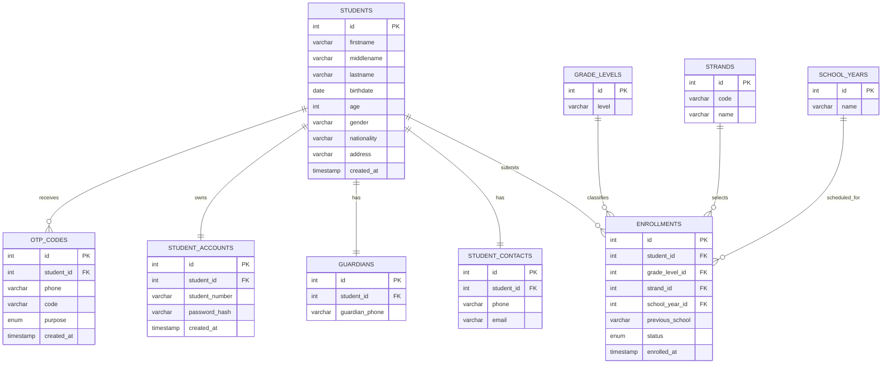

# Simple Enrollment System ERD

## Relationship Summary

- `students` stores only the learner's personal profile.
- `student_contacts`, `guardians`, and `student_accounts` are one-to-one tables related to `students`.
- `enrollments` connects a student to one `grade_level`, one `strand`, and one `school_year`.
- `otp_codes` stores temporary OTP records for verification and is removed after successful use.
- Foreign keys use `ON DELETE CASCADE` for student-owned data, so deleting a student also removes their contacts, guardian record, account, enrollments, and OTP codes.
